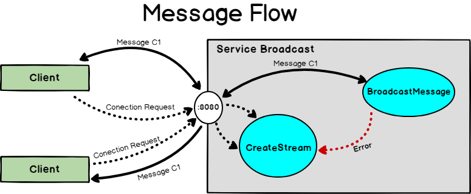

# Chat-Message-Microservice-Using-Docker-gRPC
A microservicce oriented approach for a chat server with golang

# Objectives
- Use gRPC proeminent tech to solve commom tasks like a simple chat server, gRPC really excels as a substitute to usual JSON and xml, beeing faster then these twos and easy to mantain.
- Use concurrency. Although most people recommend to not use concurrency in API's I thought that in this case I could use a lot and use safely.

# The Service

I created a "Service" definition on the proto file wich later will be compiled using the grpc plugin to generate go code accordingly. This Service has two function and use messages as parameter also defined in the proto file. Messages are like objects and carry informations. With gRPC, as RPC refere to Remote Procedure Call I can make my server infraestrutcture serve functions to clients so they could use those functions remote and safe. gRPC is build based on protobuf, it's some great tech, its fast, multiplatform, largely supported.
The way this works is that a client first make a connection request, so its created a Stream object related to it, then every message that comes in is broadcasted through all the clients. 

Its very simple code but I was able to exercise a lot and was really fun. So Cheers!
